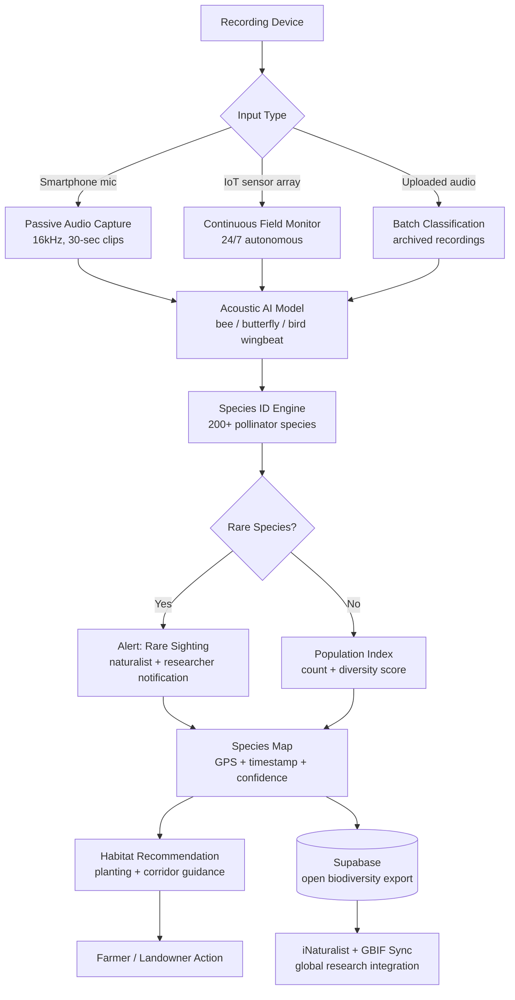

<p align="center">
  <h1 align="center">foundation-pollinator-watch</h1>
  <h3 align="center"><em>Acoustic detection. Species mapping. Protecting the insects that grow one-third of our food.</em></h3>
</p>

<p align="center">
  <a href="LICENSE"></a>
  
  
  <a href="https://mama.oliwoods.ai"></a>
  <a href="https://mama.oliwoods.ai/foundation"></a>
</p>

---

> *"40% of invertebrate pollinator species — particularly bees and butterflies — face extinction. Pollinators contribute $235–577 billion annually to global food production. Their collapse would be irreversible."*
> — IPBES Global Assessment on Biodiversity and Ecosystem Services, 2019

---

## Why This Exists

Pollinators are the invisible workforce behind one-third of every meal. Bees, butterflies, beetles, birds, and bats move pollen between flowers — enabling the reproduction of 75% of the world's flowering plant species and 35% of global food crop volume. They are disappearing faster than almost any other animal group.

- **The numbers are alarming.** North America has lost 3 billion birds since 1970 — a 29% decline — and insect populations in monitored areas have fallen 75% in under 30 years (Hallmann et al., *PLOS ONE*, 2017).
- **Neonicotinoids are still in widespread use.** The most common class of pesticide on Earth is systemic and persistent — it remains in soil and pollen for months, impairing bee navigation, memory, and reproduction at sub-lethal doses (European Food Safety Authority, 2018).
- **Monitoring is broken.** Pollinator population data relies on expert naturalist surveys that happen once a year, in a fraction of the landscape. Machine acoustic detection can run 24/7 across millions of acres.
- **Farmers don't know which habitats to protect.** Habitat corridors, hedgerows, and wildflower strips are the cheapest, most effective conservation tool — but only if planted where pollinators actually need them.

Foundation Pollinator Watch uses passive acoustic monitoring, species-specific call libraries, and AI classification to turn any smartphone into a continuous pollinator census station — building the first real-time, open-access pollinator map at landscape scale.

---

## System Architecture



---

## Features & Modules

| Module | What It Does |
|---|---|
| **Acoustic Species Detector** | AI model trained on 200+ pollinator species: identifies bees, butterflies, beetles, hoverflies, and bats by wingbeat frequency and flight pattern |
| **Real-Time Population Index** | Continuous count of pollinator activity by species and location; tracks seasonal trends |
| **Rare Species Alert System** | Flags IUCN Red List species sightings and routes alerts to local naturalists and researchers within 60 minutes |
| **Pesticide Correlation Map** | Overlays pollinator decline data with county-level USDA pesticide use records to surface hotspots |
| **Habitat Suitability Mapper** | AI-generated recommendations for wildflower strips, hedgerows, and nesting sites by land parcel |
| **Citizen Science Network** | 30-second clip submission from any smartphone; AI classifies, validates, and adds to global dataset |
| **iNaturalist / GBIF Sync** | Verified sightings automatically synced to iNaturalist and GBIF for global researcher access |
| **Colony Health Tracker** | Acoustic hive monitoring: detects queen loss, Varroa stress, and winter cluster failure in managed beehives |
| **Agricultural Impact Calculator** | Estimates crop yield risk from local pollinator decline; quantifies economic case for habitat investment |

---

## Quick Start

```bash
git clone https://github.com/OliWoods-Org/foundation-pollinator-watch.git
cd foundation-pollinator-watch
npm install
cp .env.example .env
npm run dev
```

Environment variables needed:
- `GBIF_API_KEY` — [Global Biodiversity Information Facility](https://www.gbif.org/developer/summary)
- `INATURALIST_API_TOKEN` — [iNaturalist API](https://www.inaturalist.org/pages/api+reference)
- `SUPABASE_URL` + `SUPABASE_ANON_KEY`
- `ANTHROPIC_API_KEY` — for habitat recommendation engine

---

## Tech Stack

- **Runtime:** Node.js + TypeScript
- **Validation:** Zod schemas
- **Database:** Supabase (PostgreSQL + PostGIS) — geotagged biodiversity records
- **AI:** Custom acoustic classification model + Claude API (habitat recommendations)
- **Data Sources:** GBIF, iNaturalist, USDA NASS Pesticide Use Data, IUCN Red List API
- **Audio:** Web Audio API (browser) + libsox (server-side processing)

---

## Research Citations

1. **IPBES (2019).** *Global Assessment Report on Biodiversity and Ecosystem Services.* Pollinator extinction risk and food system value. [ipbes.net/global-assessment](https://ipbes.net/global-assessment)
2. **Hallmann, C.A. et al. (2017).** "More than 75% decline over 27 years in total flying insect biomass in protected areas." *PLOS ONE,* 12(10). DOI: 10.1371/journal.pone.0185809
3. **Potts, S.G. et al. (2016).** "Safeguarding pollinators and their value to human well-being." *Nature,* 540, 220–229. DOI: 10.1038/nature20588
4. **European Food Safety Authority (2018).** "Neonicotinoids pose unacceptable risk to bees." EFSA Journal 2018;16(2). DOI: 10.2903/j.efsa.2018.5278
5. **Rosenberg, K.V. et al. (2019).** "Decline of the North American avifauna." *Science,* 366(6461), 120–124. DOI: 10.1126/science.aaw1313

---

## Contributing

Entomologists, acoustic ecologists, farmers, and citizen naturalists are all welcome.

1. Fork the repo
2. Create a feature branch (`git checkout -b feat/amazing-feature`)
3. Commit your changes
4. Push and open a PR

Priority areas: expanding the acoustic model to tropical species, adding Māori and indigenous language support, and integrating managed hive sensor hardware.

---

## License

AGPL-3.0 — Free to use, modify, and distribute. Improvements must remain open source.

---

<p align="center">
  <strong>Built by the <a href="https://oliwoods.ai">OliWoods Foundation</a></strong><br>
  <em>Free forever. Open source. Because a world without pollinators is a world without food.</em>
</p>
